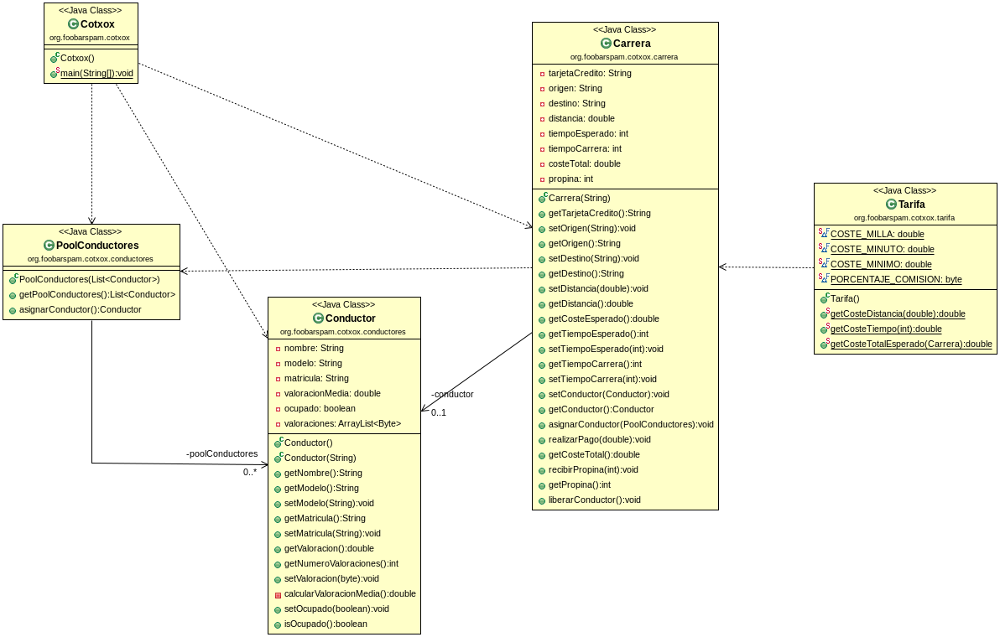

# CotxoxFueraDePlazo
En este repositorio voy a incluir el Examen de Java de años anteriores aplicando las metodologías correctamente y git flow. Este repositorio simplemente es para que las empresas a las cuales valla aplicar puedan venir observar cual es mi nivel de programación actual, no se debe de tener en cuenta a la hora de poner la nota de está avaluación, ya que debería haberse incluido anteriormente en mi perfil de GitHub y podría considerarse injusto referente a los compañeros que ya han sido evaluado y no han tenido oportunidad de poder añadirlo ellos también. Ya que el kata tanto Cotxox como Bicipalma los he ido resolviendo en locacal varias veces pero con ayuda de los repos de nuestro profesor David, sin aplicar las técnicas de git Flow aprendidas y olvidando que GitHub siempre será nuestra mejor carta de presentación, por estás razones me urge y me gustaría poder tenerlo en mi repositorio pudiendo aplicar y reflejar todo lo aprendido durante la primera avaluación del Grado Superior de Programación. Una vez las notas hayan sido fijadas este repositorio substituirá al actual de Cotxox que se puede encontrar en mi perfil.  

# Cotxox Java Kata

> In this repository you'll find **Cotxox Kata**. This kata is for introduce yourself into the beginnings of Java, the SOLID principles and how to develop a good OOP programming applying the TDD correctly.

## Table of Contents

1. [Motivation](#motivation)
1. [Used Technologies](#used-technologies)
1. [Reflections](#reflections)
1. [UML Diagram](#uml-diagram)
1. [License](#license)

---

## Motivation

One of mybiggest motivations for this kata is the fact of be one of the first Katas i ever made in the Java language. It has helped me a lot to start build a good base in the OOP programming paradigm. I was really scared about how will be the transition of Python to Java but I've been surprised of how much it turn out it likes me Java, i could get a hint of how powerful this language could be implementing a good OOP programming paradigm.

---

**[⬆ back to top](#table-of-contents)**

## Used Technologies

- Java
- Junit
- Maven
- Jacoco
- MarkDown
- Github

---

**[⬆ back to top](#table-of-contents)**

## Reflections

It has been a really enjoyable kata, an easy level about the program to develop but what matters is not the result, in this kata what matters is the process you follow until you finish the kata, trying to apply correctly all the methodologies we have learned until now and step by step implemment them. I really enjoyed being meticulous in my process. I tried to apply correctly the SOLID Principles and i kept myself all time doing TDD programming to keep all my methods under control and try to avoid unnecesary mistakes. As well has been my first time trying to avoid block codes of nested if-elses trying to use streams, really usefull and one time you start to understand hoe they work will save you lot of time and unnecesary blocks of code that coul be avioded.

Completely recommendable Kata to anyone that is interested into the Java programming language, the OOP, SOLID Principles and TDD methodologies.

---

**[⬆ back to top](#table-of-contents)**

## UML Diagram

---

**[⬆ back to top](#table-of-contents)**

## License

MIT License

Copyright (c) 2020 AntoniPizarro and Pau Llinàs

Permission is hereby granted, free of charge, to any person obtaining a copy
of this software and associated documentation files (the "Software"), to deal
in the Software without restriction, including without limitation the rights
to use, copy, modify, merge, publish, distribute, sublicense, and/or sell
copies of the Software, and to permit persons to whom the Software is
furnished to do so, subject to the following conditions:

The above copyright notice and this permission notice shall be included in all
copies or substantial portions of the Software.

THE SOFTWARE IS PROVIDED "AS IS", WITHOUT WARRANTY OF ANY KIND, EXPRESS OR
IMPLIED, INCLUDING BUT NOT LIMITED TO THE WARRANTIES OF MERCHANTABILITY,
FITNESS FOR A PARTICULAR PURPOSE AND NONINFRINGEMENT. IN NO EVENT SHALL THE
AUTHORS OR COPYRIGHT HOLDERS BE LIABLE FOR ANY CLAIM, DAMAGES OR OTHER
LIABILITY, WHETHER IN AN ACTION OF CONTRACT, TORT OR OTHERWISE, ARISING FROM,
OUT OF OR IN CONNECTION WITH THE SOFTWARE OR THE USE OR OTHER DEALINGS IN THE
SOFTWARE.

---

**[⬆ back to top](#table-of-contents)**
